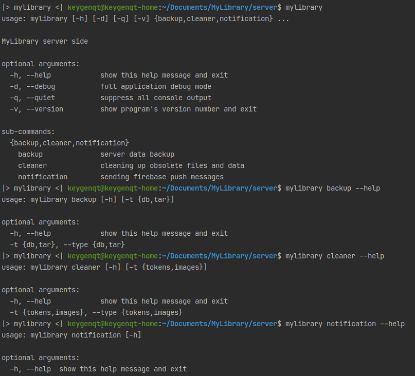

My Library
===================

MyLibrary is an application for cataloging your books library.
The application is designed to help unite lovers of literature.
Find a rare book among users MyLibrary.

**It's server part - [Cement](https://builtoncement.com/)**

* server data backup
* cleaning up obsolete files and data
* sending firebase push messages

Configurable via a config (~/.mylibrary.yml). Example config you can find in a folder 'conf' github project.

#### mylibrary backup -t=db
Back up the database. You can specify a folder or ftp in the configuration file.

#### mylibrary backup -t=tar
Back up the files or dirs in tar.gz. For compression use pigz (& tar) with multi-stream archive build capability.

#### mylibrary cleaner -t=tokens
Clearing obsolete tokens from the database. Application specific.

```python
# find method in the project for change for your app
def clear_old(cls, app):
```

#### mylibrary cleaner -t=images
Clearing non-database images in the folder specified in the configuration file.

#### mylibrary notification
Messaging google push firebase. Application specific. You need to build a request for a specific database.

```python
# find method in the project for change for your app
def find_open(cls, app):
```

